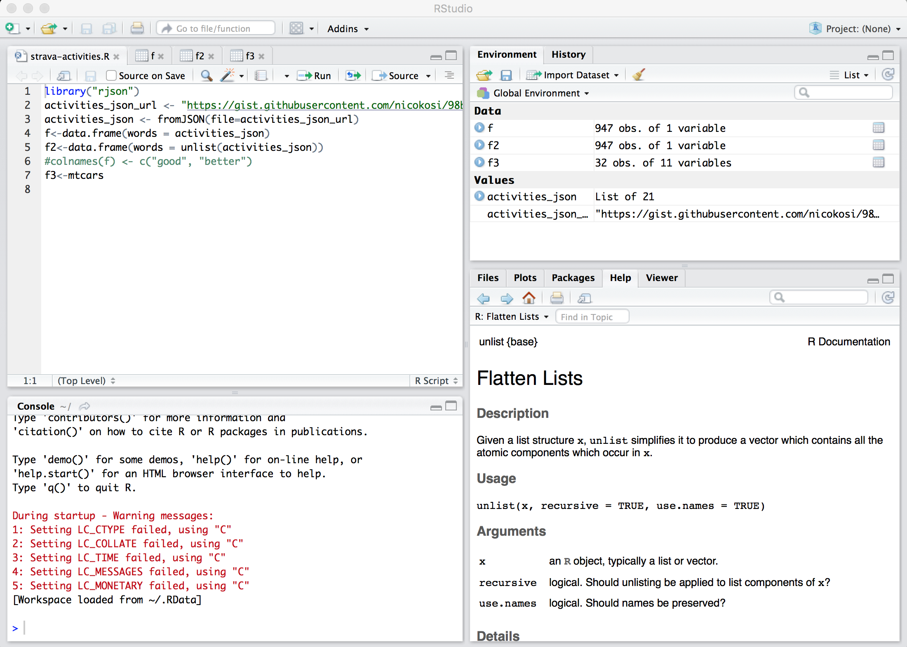

Title: Creating Strava charts with Clojure and Incanter
Date: 2017-04-09 17:37
Tags: strava charts clojure incanter
Slug: creating-strava-charts-with-clojure-and-incanter
Author: Nicolas Kosinski
Summary: Use Clojure Incanter to generate custom Strava charts
Lang: en

#Creating Strava charts via Clojure and Incanter

I use [Strava](https://www.strava.com/) to record my jogging sessions: I can record my sessions via my smartphone, publish them so that I can view/share them on strava.com.

In addition to Strava dashboard, I wanted to generate my own charts in order to visualize my progress.


<br/>
##First attempt: via R
In first tried to use [RStudio](https://www.rstudio.com/), an IDE for R. I know this tool is very well-suited but I don't know much about it. After a few hours, I was not able to load and transform JSON data.



Note to myself: try again another time! 😅


<br/>
##Second attempt: via Clojure and Incanter
I then used another option: [Incanter](http://incanter.org), which is
> Clojure-based, R-like platform for statistical computing and graphics.

Basically, I had to:

1. call Strava API that return activities as JSON data
2. transform data: do basic conversions (meters per second into km/h, seconds into minutes)
3. display charts: average speed per date

So let's dive into it!

<br/>
###1. Retrieve data via Strava API

The following function calls the [Strava API for activities](http://strava.github.io/api/v3/activities/) with an authorization token, and retrieves the 200 last activities (run/ride/swim) as a JSON object array and converts is to a sequence of Clojure maps:
```clojure
(defn strava-activities [token]
  (json/read-str (:body
                   (http-client/get
                     "https://www.strava.com/api/v3/activities"
{:query-params {:access_token token :per_page 200}}))))
```

<br/>
###2. Transform data

We can operate some data transformation, defining the following functions:
```clojure
; Display speed unit in km/h (Strava API returns m/s):
(def meters-per-second->kilometers-per-hour (partial * 3.6))

; Display durations in minutes (Strava API returns seconds):
(defn- seconds->minutes [s] (/ s 60))

; Incanter can only generate charts for numerical data, so ISO dates must be converted to timestamps:
(defn- string-date->millis [str-date]
  (.getTime
    (clojure.instant/read-instant-date str-date)))
```
These functions can be applied on activities data via the "thread-last" operator (```->>```), which is great for function pipelines:
```clojure
(->> (strava-activities token)
       (map #(update-in % ["average_speed"] meters-per-second->kilometers-per-hour))
       (map #(update-in % ["start_date_local"] string-date->millis))
       (map #(update-in % ["elapsed_time"] seconds->minutes))
       (map #(update-in % ["moving_time"] seconds->minutes)))
```


<br/>
###3. Display a chart via Incanter

The final step is to use an Incanter function to display a chart:
```clojure
(defn display-chart [token]
  (let [activities (get-activities token)]
    (with-data
      (to-dataset activities)
      #_(view $data)
      (view
        (time-series-plot
          ($ :start_date_local)
          ($ :average_speed)
          :group-by ($ :type)
          :title "Average speed over time"
          :x-label "time"
          :y-label "average speed (km/h)"
          :points true
          :legend true)))))
```

All this code displays this kind of chart:


<br/>
You can find the full code that generates several charts in [strava-activity-graphs GitHub repository](https://github.com/nicokosi/strava-activity-graphs/).
