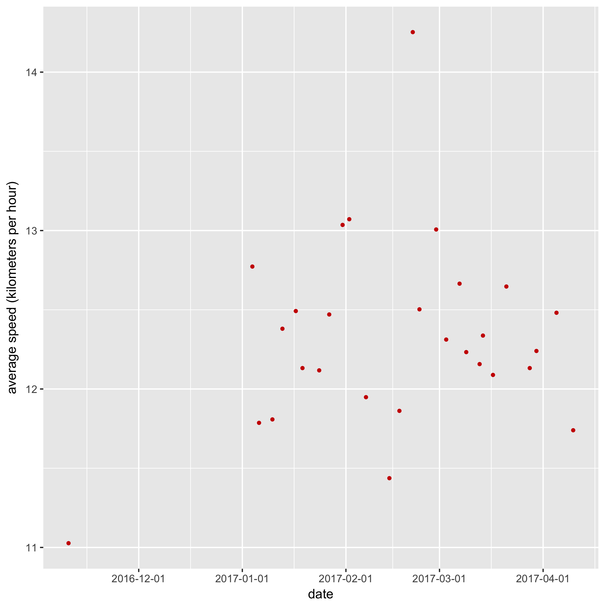

Title: Creating Strava charts with R
Date: 2017-04-14 12:10
Tags: strava charts r rstudio
Slug: creating-strava-charts-with-r
Author: Nicolas Kosinski
Summary: Use R to generate custom Strava charts
Lang: en

#Creating Strava charts with R

This article is the sequel of [Creating Strava charts with Clojure and Incanter](creating-strava-charts-with-clojure-and-incanter-en.html): I decided to have another try generating charts with R (even though I don't know much about it).

R seems to be well-suited for charts generation. The free IDE [RStudio Desktop](https://www.rstudio.com/products/RStudio/) brings several facilities: dataset visualization, variable history, integrated help etc. RStudio Desktop can be [downloaded](http://www.rstudio.com/products/rstudio/download/) or installed via a packet manager (for instance, on a Mac with `homebrew`, you can run `brew cask install rstudio` from a terminal).


So our goal is still to:

1. call Strava API that returns activities as JSON data
2. transform data: do basic conversions (meters per second into km/h, seconds into minutes, etc.)
3. display a chart (example: average speed per date)

<br/>
R has many additional libraries that are available on "CRAN repository". The following statements import the libraries I have selected:

```r
library(rjson)
library(httr)
library(ggplot2)
library(scales)
```

<br/>
###1. Retrieve data via Strava API

The following code calls the [Strava API for activities](http://strava.github.io/api/v3/activities/) with an authorization token to retrieve the 200 last activities (run/ride/swim), as a JSON string (`characters`):
```r
token <- readline(prompt="Enter Strava access token: ")
activities <- GET("https://www.strava.com/", path = "api/v3/activities",
                  query = list(access_token = token, per_page = 200))
activities <- content(activities, "text") # Retrieve JSON content as string
```

<br/>

###2. Transform data

We then need to transform our JSON content into tabular data, called `dataframes`:
```r
activities <- fromJSON(activities)      # Transform JSON content into lists
activities <- lapply(activities, function(x) {      # Apply an anonyous function on each list element
  x[sapply(x, is.null)] <- NA           # Replace nulls by "missing" (N/A)
  unlist(x)
})
df <- data.frame(do.call("rbind", activities)) # transformer les listes de listes en dataframe
```
I have to admit I "cheated" with Google because R data structures are not my cup of tea! 🤓


However, we can notice that:

- R is a dynamic languages: variable types are not specified.
- Variables can be re-affected (and their type can change)


Distances and speeds can be converted, and dates can be formatted :
```r
# Convert speeds into km/h (Strava API returns m/s):
df$average_speed <- as.numeric(as.character(df$average_speed)) * 3.6

# Convert durations into minutes (Strava API returns seconds):
df$moving_time <- as.numeric(as.character(df$moving_time)) / 60

# Convert distances into kilometers :
df$distance <- as.numeric(as.character(df$distance)) / 1000

# Format dates:
df$start_date <- as.Date(df$start_date) # ISO to yyyy-mm-dd
```

Nota bene: our dataframe contains `factors` (factors are data with all known values). Before converting them, we need to retrieve their name via the function `as.character`.


<br/>

###3. Display a chart

The final step consists in using the `ggplot2` library to display a chart for "average speed over time" and export it as a PNG image:
```r
  ggplot(df, aes(x=distance, y=moving_time)) +
    geom_point(size=1, colour="#CC0000") + # red points
    geom_smooth(method=lm) + # add a line for linear regression
    xlab("distance per activity (kilometers)") + # X label
    ylab("moving time (minutes)") # Y label
  ggsave("/tmp/moving-time.png") # save in a PNG file
```

The generated chart:



The [full code](https://gist.github.com/nicokosi/241331f67692945ddca4e4ea2cc0597d) that displays several charts.
