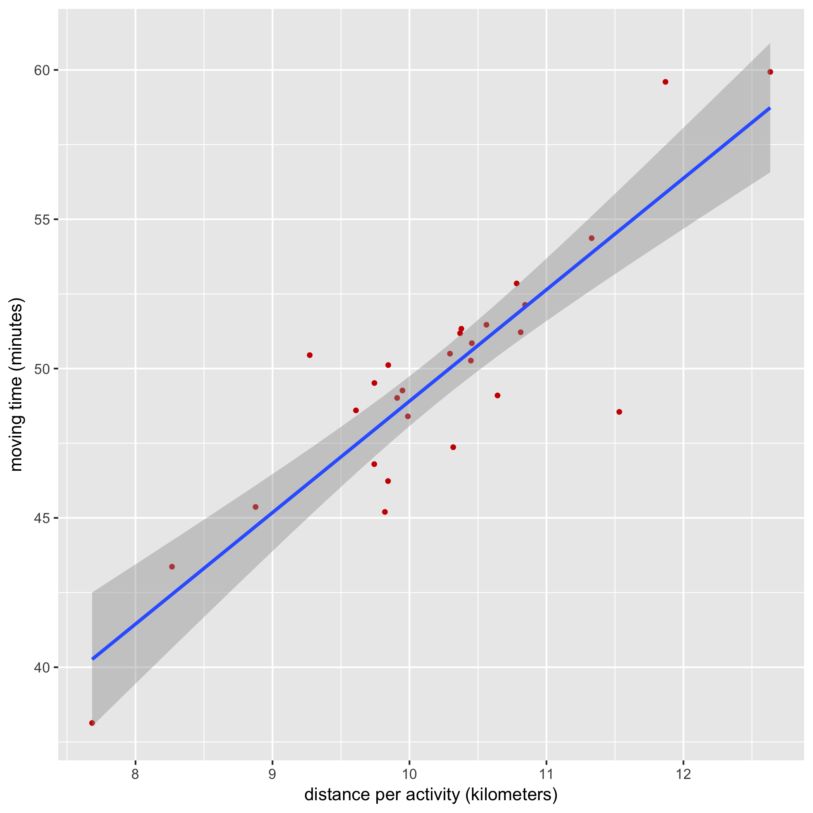

Title: Générer ses graphiques Strava avec R
Date: 2017-04-14 12:10
Tags: strava charts r rstudio
Slug: creating-strava-charts-with-r
Author: Nicolas Kosinski
Summary: Utilisation de R pour générer des graphiques Strava personnalisés
Lang: fr

#Générer ses graphiques Strava avec R

Cet article fait suite à [Générer ses graphiques Strava avec Clojure et Incanter](creating-strava-charts-with-clojure-and-incanter.html) : en effet, j'ai décidé de faire un deuxième essai de génération de graphiques avec R.

R est un langage idéal pour le calcul statistique et la génération de graphiques. J'ai fait le choix d'utiliser l'IDE gratuit [RStudio Desktop](https://www.rstudio.com/products/RStudio/) qui contient de nombreuses facilités (visualisation des données, historique des variables et des graphiques, aide intégrée etc.). RStudio Desktop est [téléchargeable](http://www.rstudio.com/products/rstudio/download/) ou peut être installé via certains gestionnaires de paquets (exemple pour mac avec `homebrew`, exécuter `brew cask install rstudio` dans un terminal).


Le but est toujours de :

1. appeler l'API Strava pour récupérer les données au format JSON
2. faire quelques transformations, essentiellement des conversions
3. afficher des graphiques (exemple : temps en mouvement en fonction de la distance parcourue)

C'est parti !


<br/>
R bénéficie de très nombreuses bibliothèques additionnelles qui sont publiques et téléchargeables automatiquement ("CRAN repository"). Voici les instructions d'import correspondant à celles que j'ai utilisées :

```r
library(rjson)
library(httr)
library(ggplot2)
library(scales)
```

<br/>
### 1. Récupérer les données Strava

Le code suivant appelle l'[API Strava "activities"](http://strava.github.io/api/v3/activities/) avec un jeton d'autorisation (access token) et récupère les 200 dernières sorties ("activities" = activité de course à pied, vélo ou natation) sous forme d'une chaîne de caractères (`characters`) :
```r
token <- readline(prompt="Enter Strava access token: ")
activities <- GET("https://www.strava.com/", path = "api/v3/activities",
                  query = list(access_token = token, per_page = 200))
activities <- content(activities, "text") # Retrieve JSON content as string
```

<br/>

###2. Transformer les données

Il faut ensuite transformer ces données en données tabulaires, appelées `dataframes`. Petite subtilité, il faut itérer sur les éléments des listes pour remplacer les valeurs vides (`null`) par des valeurs manquantes (`NA`, pour "not available") :
```r
activities <- fromJSON(activities)      # Transformer le contenu JSON en liste
activities <- lapply(activities, function(x) {      # appliquer une fonction anonyme à chaque élément de la liste
  x[sapply(x, is.null)] <- NA           # remplacer les valeurs nulles en "N/A"
  unlist(x)
})
df <- data.frame(do.call("rbind", activities)) # transformer les listes de listes en dataframe
```
J'avoue que j'ai triché en "googlant" car les manipulations de structures ne sont pas super évidentes pour moi ! 🤓

On peut en tout cas remarquer que les variables ne sont pas typées - R est un language dynamique - et peuvent être ré-affectées. Par exemple, `activities` est une variable de type `character` (chaîne de caractères, contenant les données JSON) qui devient ensuite une variable de type `list`.


Il m'a fallu convertir les distances et les durées pour utiliser des unités plus appriopriées :
```r
# Convertir les durées en minutes (l'API Strava API retourne des secondes) :
df$moving_time <- as.numeric(as.character(df$moving_time)) / 60

# Convertir les distances en kilomètres (l'API Strava API retourne des mètres) :
df$distance <- as.numeric(as.character(df$distance)) / 1000
```

Pour l'anectode, les données sont des `factors`, c'est-à-dire des données dont on connaît toutes les valeurs (une énumération, en quelque sorte). Avant de les convertir, il faut récupérer leur libellé via la fonction `as.character`.


<br/>

###3. Affichage d'un graphique

La dernière étape consiste à utiliser l'une des fonctions de la librairie `ggplot2` pour afficher et sauvegarder un graphique. Le code suivant affiche le temps en mouvement en fonction de la distance parcourue :
```r
  ggplot(df, aes(x=distance, y=moving_time)) + # à partir du dataframe, afficher les données 'distance' en fonction de 'moving_time`
    geom_point(size=1, colour="#CC0000") + # afficher les points en rouge
    geom_smooth(method=lm) # ajout d'une courbe de régression linéaire +
    xlab("distance per activity (kilometers)") # libellé de l'axe X +
    ylab("moving time (minutes)") # libellé de l'axe Y
  ggsave("/tmp/moving-time.png") # sauvegarder dans un fichier PNG
```

Le graphique généré :



Voici le lien vers le [code complet](https://gist.github.com/nicokosi/241331f67692945ddca4e4ea2cc0597d) pour afficher plusieurs graphiques similaires.
