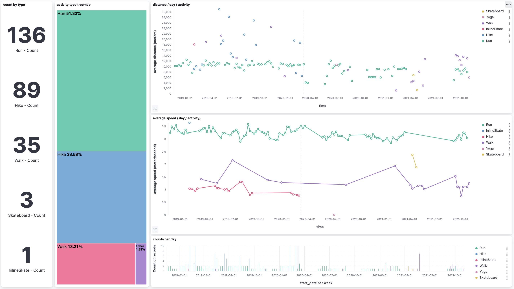

Title: Exploration des données sportives Strava avec Kibana (2ème partie) : un dashboard amélioré
Date: 2021-11-09 07:00
Tags: dataviz data visualization
Slug: explore-strava-activities-with-kibana-2
Author: Nicolas Kosinski
Summary: Comment j'ai créé un dashboard détaillé et interactif pour explorer visuellement mes sorties sportives strava.com.
Lang: fr

Public présumé : personnes intéressées par l’exploration de données.

Cet article fait suite à [ce premier article](./explore-strava-activities-with-kibana.html) pour la mise en place de Kibana et l'import des données Strava.

Franck, un collègue qui connaît bien Kibana, m'a conseillé d'essayer un graphique  de type "vertical bar" avec un opérateur "count".
J'ai notamment voulu essayer ce type de graphique, tout en en testant d'autres, en créant un "dashboard" plus complet que celui détaillé dans mon premier article.

J'ai créé avec les graphiques suivants :

* "histogramme de la vitesse moyenne", en utilisant un graphique `Vertical bar` : _Y-axis_ "average(average_speed)", _X-axis_ "@timestamp" and _Split series_ on "type".

* "compteurs d'activités par type", en utilisant un graphique de type `Metric` avec _Aggregation_ "Count" and _Split group_ sur "type".

* "histogramme de la distance parcourue", en utilisant un graphique de type `Vertical bar` : _Y-axis_ "average(distance)", _X-axis_ "@timestamp" et _split series_ sur "type".

* "tree map du nombre d'activité par type", en utilisant un graphique de type `Treemap` chart avec _Group by_ "type.

* "compteurs d'activités par jour" en utilisant un graphique de type `Bar vertical` avec _horizontal axis_ sur "start_date", _vertical axis_ sur "Count of records" et _break down by_ "top values of type".

Et voila le dashboard final : 🎉

.

Le même dashboard après avoir cliqué sur le type d'activité "Run" (course à pied) :

.

Le dashboard et ses graphiques peuvent être importés via le bouton en haut à gauche (avec trois traits horizontaux) / "Management" / "Stack Management" / "Saved Objects" / "Import" avec ce [fichier d'import du dashboard]({static}/misc/strava-dashboard.ndjson).