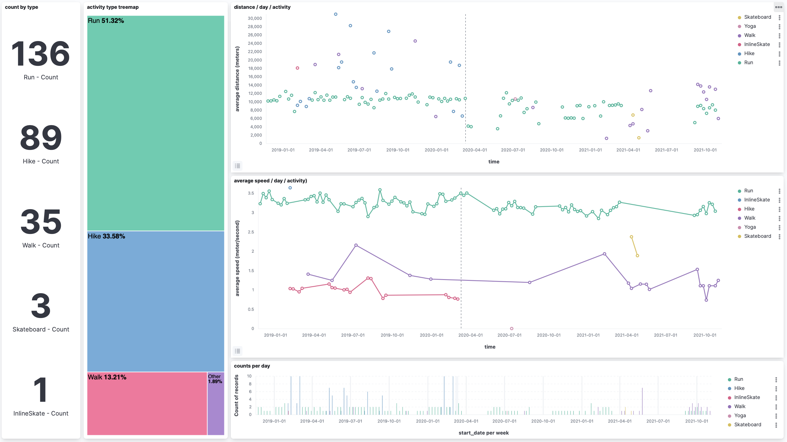
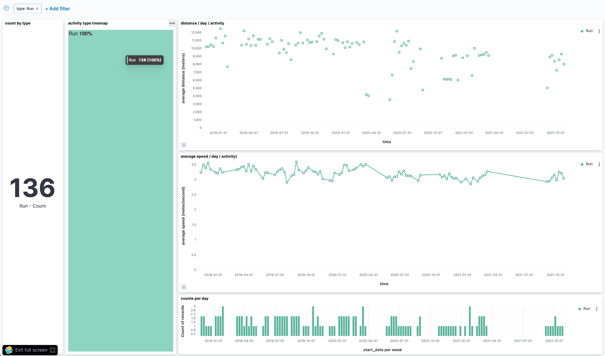

Title: Exploring my own Strava activities using Kibana (part 2): a better dashboard
Date: 2021-11-09 07:00
Tags: dataviz data visualization
Slug: explore-strava-activities-with-kibana-2
Author: Nicolas Kosinski
Summary: Use Kibana to explore my personal Sport activities from strava.com (part 2) - create a better dashboard
Lang: en

Assumed audience: people interested in data exploration.

Please read the [first part on this article](./explore-strava-activities-with-kibana-en.html) about the Kibana setup and Strava data injection.

My colleague Franck gave me a cool Kibana tip: try the "vertical bar" with a "count" operator.

In order to give it a try, I created a dashboard with the following charts:

* "average speed histogram", using a `Vertical bar` chart: Y-axis is "average(average_speed)", X-axis is "@timestamp" and Split series on "type".

* "count activities by type", using a `Metric` chart, using Aggregation "Count" and Split group on "type".

* "distance histogram", using a `Vertical bar` chart: Y-axis is "average(distance)", X-axis is "@timestamp" and split series on "type".

* "activity type tree map", using a `Treemap` chart with Group by "type.

* "counts per day" using a `Bar vertical` chart with horizontal axis on "start_date", vertical axis on "Count of records" and break down by "top values of type".

Here is a preview of the final dashboard: 🎉

.

The same dashboard when clicking on "Run" activity type:

.

The dashboard with its charts can be imported via the upper left button / "Management" / "Stack Management" / "Saved Objects" / "Import" with [this file]({static}/misc/strava-dashboard.ndjson).