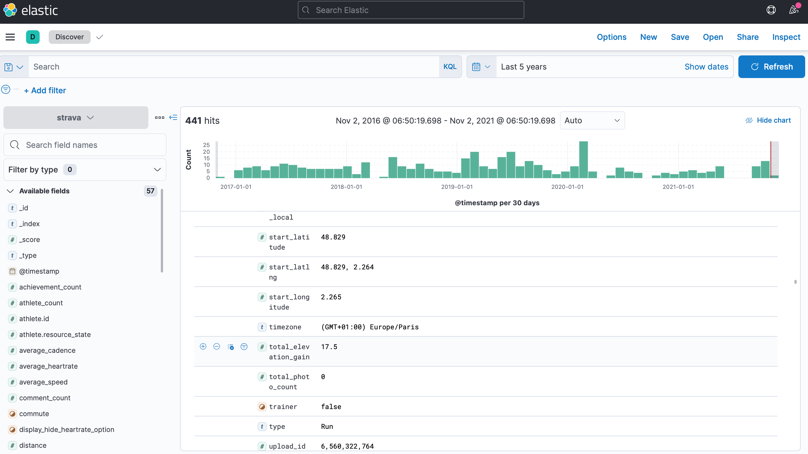
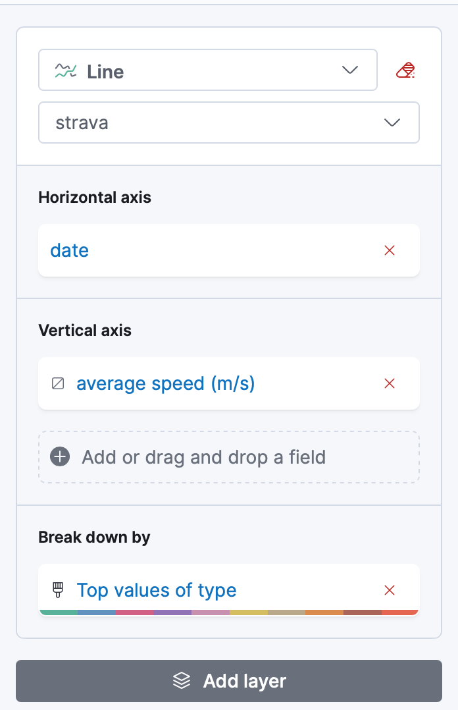

Title: Exploratation des données sportives Strava avec Kibana
Date: 2021-11-03 13:00
Tags: dataviz data visualisation
Slug: explore-strava-activities-with-kibana
Author: Nicolas Kosinski
Summary: Utilisation de Kibana pour explorer mes sorties sportives strava.com
Lang: fr

Public présumé : personnes intéressées par l’exploration de données.

Cela fait quelques années que j'enregistre mes sorties sportives (essentiellement pour la course à pied et la marche) sur [strava.com](https://strava.com/).
Comme les données sont accessibles par une API, j'ai voulu les explorer en utilisant un outil de visualisation de données, [Kibana](https://www.elastic.co/kibana/).
Cet article décrit mon premier essai "d'exploration".

## Mise en place

Noter que le code ci-dessous utilise le shell Unix `zsh`.

### Récupération des activités Strava

Il faut d'abord créer [un compte développeur Strava](https://developers.strava.com/docs/getting-started/#account) puis créer un jeton OAuth2 (j'ai utilisé [le générateur mgryszko/strava-access-token](https://github.com/mgryszko/strava-access-token)).

Ensuite, on peut utiliser [l'API Strava API pour récupérer les activités](https://developers.strava.com/docs/reference/#api-Activities-getLoggedInAthleteActivities) pour générer plusieurs fichiers JSON :

```zsh
for page in {1..10}; http GET "https://www.strava.com/api/v3/athlete/activities?include_all_efforts=&per_page=200&page=${page}" "Authorization: Bearer $TOKEN" > strava-activities-${page}.json
```

Ayant un historique d'environ 300 sorties, seuls 3 fichiers ont du contenu (les autres contient un tableau vide : `[]`), comme on peut le voir avec la commande `wc` :

```zsh
wc -c strava-activities-*.json

  421462 strava-activities-1.json
       2 strava-activities-10.json
  288391 strava-activities-2.json
   57159 strava-activities-3.json
       2 strava-activities-4.json
       2 strava-activities-5.json
       2 strava-activities-6.json
       2 strava-activities-7.json
       2 strava-activities-8.json
       2 strava-activities-9.json
  767026 total
```

Pour finir, agrégeons ces fichiers dans un fichier unique au format "Newline Delimited JSON" (extension `ndjson`) :

```zsh
for n in {1..3}; cat strava-activities-${n}.json | jq -c '.[]' > strava-activities-${n}.ndjson
cat strava-activities-1.ndjson strava-activities-2.ndjson strava-activities-3.ndjson >> strava-activities.ndjson
```

### Import des données

Nous allons utiliser les [images officielles Docker](https://www.elastic.co/guide/en/kibana/current/docker.html).

Démarrons les services Elastic et Kibana :

```sh
docker network create elastic
docker run --name es-dataviz --net elastic --publish 9200:9200 --publish 9300:9300 --env "discovery.type=single-node" --env "xpack.security.enabled=false" docker.elastic.co/elasticsearch/elasticsearch:7.15.1
```

```sh
docker run --name kb-dataviz --net elastic --publish 5601:5601 --env "ELASTICSEARCH_HOSTS=http://es-dataviz:9200" --env "xpack.security.enabled=false" docker.elastic.co/kibana/kibana:7.15.1
```

Puis importons les données ("upload") en sélectionnant le fichier `ndjson` [http://localhost:5601/app/home#/tutorial_directory] que nous importons dans un index nommé "strava" :

Ouvrons ensuite la vue "discover" pour les 6 dernières années :



## Exploration des données

### Vitesse moyenne par sortie

Créons un _dashboard_ pour visualiser l'évolution dans le temps de la vitesse moyenne par type d'activité (course, marche etc.) :



Ca ressemble à ça :


Quelques remarques / interprétations :

- je ne pensais pas courir depuis si longtemps (5 ans) 😯

- mes performances baissent dans le temps, c'est normal, je vieillis ! 🧓

Et sinon, j'ai trouvé ça sympa de faire mon propre dashboard éphémère (non persisté) sans payer l'abonnement Strava. 😇

C'est tout pour cette fois. J’essaierai d'aller plus loin dans un autre article. 🤓
