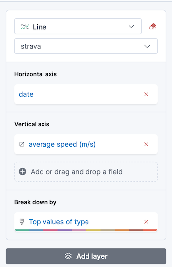

Title: Exploring my own Strava activities using Kibana
Date: 2021-11-03 09:00
Tags: dataviz data visualization
Slug: explore-strava-activities-with-kibana
Author: Nicolas Kosinski
Summary: How I imported my personal Sport strava.com activities into Kibana in order to explore them.
Lang: en

Assumed audience: people interested in data exploration.

I use [strava.com](https://strava.com/) to track my running/hike activities since a few years. Since Strava provides an API to export my activities, I had a try exploring them via a data visualization tool, [Kibana](https://www.elastic.co/kibana/). This article relates my first exploration.

## Setup

Note that the code shown below uses `zsh` Unix shell.

### Grab Strava activities

First step, create a [Strava developer account](https://developers.strava.com/docs/getting-started/#account), then create a Strava API OAuth2 access token (I have used the [mgryszko/strava-access-token generator](https://github.com/mgryszko/strava-access-token)).

Second step, use [the Strava API to grab my Strava activities](https://developers.strava.com/docs/reference/#api-Activities-getLoggedInAthleteActivities), exporting all activities into separate JSON files:

```zsh
for page in {1..10}; http GET "https://www.strava.com/api/v3/athlete/activities?include_all_efforts=&per_page=200&page=${page}" "Authorization: Bearer $TOKEN" > strava-activities-${page}.json
```

Since I have recorded around 300 activities with Strava, only three files have a non-empty content (empty JSON content is `[]`), as seen with the `wc` command:

```zsh
wc -c strava-activities-*.json

  421462 strava-activities-1.json
       2 strava-activities-10.json
  288391 strava-activities-2.json
   57159 strava-activities-3.json
       2 strava-activities-4.json
       2 strava-activities-5.json
       2 strava-activities-6.json
       2 strava-activities-7.json
       2 strava-activities-8.json
       2 strava-activities-9.json
  767026 total
```

Third step, aggregate files into a single "Newline Delimited JSON" file (`ndjson` extension):

```zsh
for n in {1..3}; cat strava-activities-${n}.json | jq -c '.[]' > strava-activities-${n}.ndjson
cat strava-activities-1.ndjson strava-activities-2.ndjson strava-activities-3.ndjson >> strava-activities.ndjson
```

### Insert data into Kibana

We will run Elastic and Kibana using the [official Docker images](https://www.elastic.co/guide/en/kibana/current/docker.html).

Start Elastic and Kibana:

```sh
docker network create elastic
docker run --name es-dataviz --net elastic --publish 9200:9200 --publish 9300:9300 --env "discovery.type=single-node" --env "xpack.security.enabled=false" docker.elastic.co/elasticsearch/elasticsearch:7.15.1
```

```sh
docker run --name kb-dataviz --net elastic --publish 5601:5601 --env "ELASTICSEARCH_HOSTS=http://es-dataviz:9200" --env "xpack.security.enabled=false" docker.elastic.co/kibana/kibana:7.15.1
```

Upload `ndjson` file [http://localhost:5601/app/home#/tutorial_directory] into an index named "strava":

Open Kibana's "discover" view for the last 6 years:


## Explore data / create dashboards

### Average speed per activity

Let's create a dashboard to visualize the activities' average speed by activity type (run, hike etc.):



It looks like this:


A few remarks:

- I just realized that I have been running for 5 years! 😯

- my running performance are slowing down... I guess I am getting older! 🧓

Anyway, it was cool to make my custom (but ephemeral) dashboard without paying for Strava. 😇

That's all! I'll try to go further an other time. 🤓
