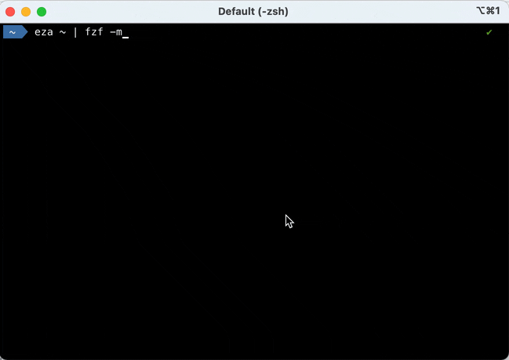

Title: A few "unix-like" terminal tricks 🧙
Date: 2024-11-28 06:52
Modified: 2024-12-18 07:00
Tags: shell terminal cli tui
Slug: nix-terminal-tricks
Author: Nicolas Kosinski
Summary: unix-like shell tricks
Lang: en
# A few "unix-like" terminal tricks 🧙

Assumed audience: developers interested in using the terminal for various tasks.

As a developer, I like using shell commands in my terminal. Here are a few random tips I have. Maybe you can learn from them, or give me back your tips/advises?

## Simplified help using `tldr` 📝

I cannot remember all command options, and I like to find help in my terminal, without using internet or AI.

So I often use [tldr](https://tldr.sh) as a cheat sheet, it's OK for many common options!

For instance, `tldr npm` outputs:

```
  JavaScript and Node.js package manager.
  Manage Node.js projects and their module dependencies.
  More information: <https://www.npmjs.com>.

  Create a `package.json` file with default values (omit `--yes` to do it interactively):

      npm init -y|--yes

  Download all the packages listed as dependencies in `package.json`:

      npm install

  Download a specific version of a package and add it to the list of dependencies in `package.json`:

      npm install package_name@version

  Download the latest version of a package and add it to the list of dev dependencies in `package.json`:

      npm install package_name -D|--save-dev

  Download the latest version of a package and install it globally:

      npm install -g|--global package_name

  Uninstall a package and remove it from the list of dependencies in `package.json`:

      npm uninstall package_name

  List all locally installed dependencies:

      npm list

  List all top-level globally installed packages:

      npm list -g|--global --depth 0
```

## Aliases 📛

### Permanent aliases

Use case: speed-up typing for frequently used commands.

For instance, since I often use Maven's `mvn` commands in my terminal, I have defined this alias in my shell configuration:
```sh
alias mvncist="mvn clean install -DskipTests"
```
Then I can just type `mvncist` to build any Maven project without running tests.

### On-demand aliases

Use case: speed-up typing for commands used intensively during a given period.

For instance, as a developer, I do not use the `docker` CLI every day, but I often use it intensively when updating a Docker image or debugging an issue.

I will thus create this ephemeral for my current shell session, `alias d=docker`, then:

```sh
d ps
d images
# and so on...
```

## Filtering the output 🔎

### with `grep`

Piping with `grep` or similar commands like [ag, "the silver searcher"](https://github.com/ggreer/the_silver_searcher) is OK when I know what to search for.

For instance, I often run the `df -h | grep disk1s1` command to know available space from my local hard drive.

### with `fzf`, the "command-line fuzzy finder"

When I don't exactly know out to filter the output, I use [fzf, the "command-line fuzzy finder"](https://junegunn.github.io/fzf/).

For instance, when I want to know Java Development Kits that I have installed, I run `sdk list java | fzf`.


When I want to filter then copy several lines from command's output, the `--multi` (short `-m`) option is neat.

For instance, `eza ~ | fzf -m`.




## TUIs for speed! ⚡️

I often use the following [Text-based User Interfaces (or Terminal-based)](https://en.wikipedia.org/wiki/Text-based_user_interface), aka TUIs:

- [tig](https://jonas.github.io/tig/) to navigate git commits quickly (even if I usually use `git` in my terminal or within my favorite IDE)

- [lazydocker](https://github.com/jesseduffield/lazydocker) for managing docker containers quickly (even if usually use the `docker` command directly)

- [diskonaut](https://github.com/imsnif/diskonaut) for identifying big files on my hard disk drive

- [user-stars GitHub CLI extension]([url](https://github.com/korosuke613/gh-user-stars?tab=readme-ov-file)) to search my GitHub stars

Thanks to my colleagues who helped me learning these tricks: Amazigh, Alexis, Stéphane, Yoann, Jean-Christophe...and all the others I forget (please forgive me)! 🤗

That's all I got, nerds! 🤓
