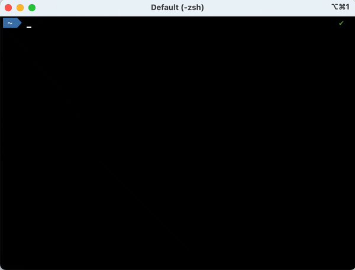
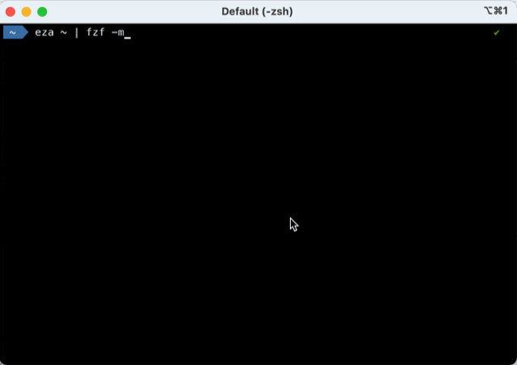

+++
title = "Quelques astuces shell \"unix-like\" que j'utilise dans mon terminal 🧙"
slug = "nix-terminal-tricks"
description = "astuces shell \"unix-like\""
date = 2024-11-28
updated = 2024-12-18
# [taxonomies]
# tags = ["shell", "terminal", "cli", "tui"]
+++
# Quelques astuces shell *nix que j'utilise dans mon terminal 🧙

Public présumé : dévelopeurs.ses utilisant leur terminal pour diverses tâches.

Voici quelques commandes / utilitaires que j'utilise régulièrement, peut-être que ça peut vous être utile ou que vous pourrez me donner votre avis ?


## l'anti-sèche `tldr` 📝

Ca m'est impossible de retenir toutes les options des commandes que j'utilise. Personnellement, j'aime avoir une sorte d'anti-sèches directement dans mon terminal, sans utiliser ni mon navigateur web, ni un outil d'intelligence artificielle comme ChatGPT.

Pour ça, j'utilise souvent [tldr](https://tldr.sh) comme une anti-sèche, c'est très pratique !

Par exemple, la commande `tldr --language fr git` affiche les 8 options les plus courantes de `git`, avec une description courte (pour information, on peut avoir les informations en plusieurs langues) :

```
Système de gestion de versions décentralisé.
Certaines commandes comme `git commit` ont leur propre documentation.
Plus d'informations : <https://git-scm.com/>.

Exécuter une sous-commande Git :

    git sous_commande

Exécuter une sous-commande Git sur un répertoire personnalisé :

    git -C chemin/vers/repertoire sous_commande

Exécuter une sous-commande Git avec un paramètre de configuration spécifique :

    git -c 'cle_param_config=valeur' sous_commande

Afficher l'aide générale :

    git --help

Afficher l'aide sur une sous-commande Git :

    git help sous_commande

Obtenir la version de Git :

    git --version
```

### aliases 📛

## alias permanents

Cas d'utilisation : taper plus vite les commandes souvent utilisées.

Par exemple, comme j'utilise souvent la commande Maven `mvn`, j'ai défini cet aliax Unix dans ma configuration de shell :

```sh
alias mvncist="mvn clean install -DskipTests"
```

Ainsi, je n'ai qu'à taper `mvncist` pour reconstruire un projet Maven sans avoir à attendre l'exécution des tests.


### aliases à la demande

Cas d'utilisation : éviter de taper de nombreuses fois la même commande que j'utilise de façon intensive pendant une période donnée.


Par exemple, je n'utilise pas souvent Docker en ligne de commandes, mais il peut m'arriver de l'utiliser plusieurs dizaines de fois pendant une heure, si j'investigue un problème ou si je définis une image via un fichier Dockerfile.
Dans ce cas, je peux être amené à créer un alias Unix qui ne dure que le temps de ma session, puis je taperai les différents commandes en utilisant cet alias :

```sh
alias d=docker
d ps
d images
# etc.
```

## filtrer la sortie 🔎

### avec `grep`

L'utilisation de _pipe_ Unix avec la commande `grep` ou ses équivalents comme [ag, "the silver searcher"](https://github.com/ggreer/the_silver_searcher) est bien utile quand je sais quoi chercher.

Par exemple, j'utilise souvent la commande `df -h | grep disk1s1` pour connaître l'espace disque restant sur mon disque dur.

### avec `fzf`, le "command-line fuzzy finder"

Quand je ne sais pas précisement quoi chercher, j'utilise souvent [fzf, the "command-line fuzzy finder"](https://junegunn.github.io/fzf/).

Par exemple, quand je veux connaître la liste des environnements Java (_Java Development Kits_) que j'ai installés, je lance peux taper la commande `sdk list java | fzf` :



Et pour copier plusieurs lignes, l'option `--multi` (ou sa version courte `-m`) est pratique.

Par exemple, `eza ~ | fzf -m` affiche :



## les _TUIs_, pour aller plus vite ! ⚡️

J'utilise plusieurs commandes de type [_Text-based User Interfaces_ (ou _Terminal-based_)](https://en.wikipedia.org/wiki/Text-based_user_interface), souvent désignées par le sigle _TUI_ :

- [tig](https://jonas.github.io/tig/) pour explorer rapidement les commits Git (même si j'utilise aussi la commande `git` dans mon terminal, ainsi que l'intégration Git de mon environnement de développement (_IDE_).)

- [lazydocker](https://github.com/jesseduffield/lazydocker) pour manipuler des containers Docker rapidement (même j'utilise aussi la commande `docker` directement)

- [diskonaut](https://github.com/imsnif/diskonaut) pour faire du ménage sur mon disque dur

- [l'extension GitHub CLI `user-stars`]([url](https://github.com/korosuke613/gh-user-stars?tab=readme-ov-file)) pour retrouver des dépôts GitHub auxquels j'ai mis une "étoile" (sorte de favori)

Avant de finir, un remerciement à mes collègues qui m'ont aidé à apprendre ces astuces. Je pense notamment à Amazigh, Alexis, Stéphane, Yoann, Jean-Christophe... et je suis sûr d'en oublier (ne m'en veuillez pas) ! 🤗

Et voilà, c'est terminé ! 🤓
